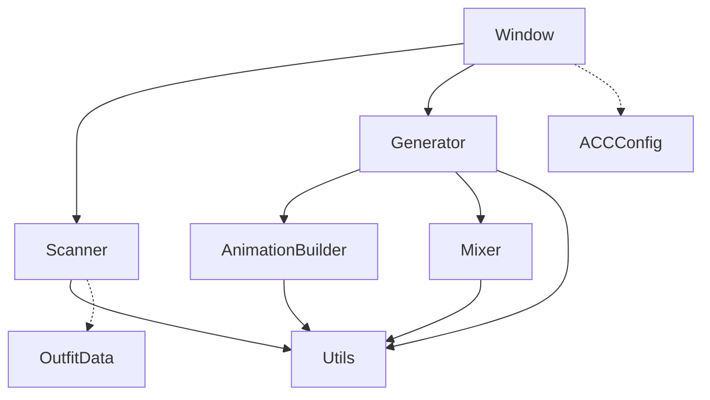

# Advanced Costume Controller

> VRChat 模型的高级服装控制器——基于 Modular Avatar，自动为服装层级生成 VRC 表情菜单和 Animator 控制器。

## 功能概述

| 功能 | 说明 |
|---|---|
| **服装切换** | 用 Int 参数在多套服装间一键切换 |
| **变体支持** | 同一服装下的多个变体（如颜色/材质），共享部件但独立切换 |
| **部件控制** | 对每套服装的子物体（如帽子、手套、裙甲）提供 Bool 开关 |
| **混搭模式 (CustomMixer)** | 特殊虚拟服装，让用户在 VRC 菜单中自由组合不同服装的部件和变体 |

## 快速开始

1. 打开 Unity 菜单栏：`Tools > UnityBox > Advanced Costume Controller`
2. 将服装根节点拖入 **Costumes Root** 字段
3. 在预览区域中勾选/取消勾选服装和部件
4. 点击 **Generate** 完成生成

## 层级结构约定

Advanced Costume Controller 通过扫描 Costumes Root 的子层级来自动发现服装：

```
Costumes Root
├── Outfit A                    ← 无变体服装
│   ├── Mesh_Body              ← Mesh 节点（有 SkinnedMeshRenderer）
│   ├── Hat                    ← 部件
│   └── Gloves                 ← 部件
├── Outfit Group B             ← 变体组
│   ├── Variant Red            ← 变体1（BaseObject）
│   │   ├── Mesh_Body
│   │   ├── Skirt
│   │   └── Boots
│   └── Variant Blue           ← 变体2
│       ├── Mesh_Body
│       ├── Skirt
│       └── Boots
└── Armature                   ← 被忽略（在 Ignore Names 中）
```

### 识别规则

- **Mesh 节点**：拥有 `SkinnedMeshRenderer` 或 `MeshRenderer + MeshFilter` 的节点
- **Outfit Base**：Mesh 节点的父节点
- **变体**：当 Outfit Base 的兄弟节点也存在时，它们被视为同一服装的变体；此时父节点成为 Outfit Group
- **部件**：Outfit Base 下的直接子节点（排除被忽略的名称）
- **忽略**：名称包含 Ignore Names 中任意关键词的节点会被跳过

## 配置项

| 参数 | 默认值 | 说明 |
|---|---|---|
| **Costumes Root** | — | 服装根节点（必填） |
| **Parameter Prefix** | `CST` | 所有生成参数的前缀 |
| **Costume Parameter Name** | `costume` | 服装切换的主 Int 参数名 |
| **Default Outfit** | 自动检测 | 默认服装（可手动指定，或由名称关键词自动匹配） |
| **Enable Parts Control** | `false` | 是否生成部件开关（普通模式下控制各服装的子部件显示/隐藏） |
| **Enable Custom Mixer** | `false` | 是否启用混搭模式（独立于 Parts Control，拥有自己的部件控制参数） |
| **Custom Mixer Name** | `CustomMix` | 混搭菜单的名称 |
| **Output Folder** | `Assets/.../Generated` | 动画和控制器的输出目录 |
| **Ignore Names** | `Armature,Bone,Skeleton` | 扫描时跳过的名称关键词 |

## 生成产物

执行 Generate 后，Advanced Costume Controller 会在 Costumes Root 下创建以下内容：

### 菜单结构（MA MenuItem 层级）

```
{Costumes Root} Menu
├── Outfit A          → Toggle (costume = 0)
├── Outfit Group B
│   ├── Parts
│   │   ├── Skirt     → Toggle (CST/Outfit_Group_B/Skirt)
│   │   └── Boots     → Toggle (CST/Outfit_Group_B/Boots)
│   ├── Variant Red   → Toggle (costume = 1)
│   └── Variant Blue  → Toggle (costume = 2)
└── CustomMix                  ← 仅 Enable Custom Mixer 时
    ├── Enable         → Toggle (costume = N)
    ├── Outfit Group B
    │   ├── Parts
    │   │   ├── Skirt  → Toggle (CST/CustomMix/...)
    │   │   └── Boots
    │   ├── Variant Red  → Toggle (Int 参数)
    │   └── Variant Blue
    └── Outfit A
        ├── Hat        → Toggle
        └── Gloves     → Toggle
```

### Animator Controller

| 层 | 说明 |
|---|---|
| **Outfit Switching** | AnyState → 各服装状态，由 `costume` Int 参数驱动 |
| **Parts Init** | 初始化所有部件为 OFF（WD=true 写入默认值） |
| **Parts Control** | Direct BlendTree，每个部件一个子动画，由 Float 参数驱动 |
| **Mixer_{Group}** | 混搭变体切换层（每个变体组一个） |
| **Mixer Parts** | 混搭模式下的部件控制层（独立参数） |

### 动画文件

```
Generated/
├── CostumeController.controller
└── Animations/
    ├── Outfit_000_OutfitA.anim
    ├── Outfit_001_VariantRed.anim
    ├── Outfit_002_VariantBlue.anim
    ├── PartsInit_OFF.anim
    ├── Parts/
    │   ├── CST_..._Skirt_ON.anim
    │   └── CST_..._Boots_ON.anim
    └── Mixer/
        └── MixerVariant_*.anim
```

## 混搭模式 (Custom Mixer) 详解

混搭模式是 Advanced Costume Controller 的高级功能，允许用户在 VRC 表情菜单中**跨服装组合部件**。

### 工作原理

1. CustomMixer 被分配一个特殊的 `costume` 索引值（所有普通服装之后）
2. 当 `costume` 切换到该索引时，Outfit Switching 层关闭所有普通服装
3. Mixer 专属的动画层接管控制：
   - **变体层**：用 Int 参数决定每个变体组显示哪个变体
   - **部件层**：用独立的 Bool/Float 参数控制每个部件的显示

### 参数命名

- 普通部件：`{prefix}/{outfitPath}/{partPath}`
- 混搭部件：`{prefix}/{mixerName}/{outfitPath}/{partPath}`
- 混搭变体组：`{prefix}/{mixerName}/{groupPath}`

参数使用独立命名空间，避免普通模式和混搭模式之间的参数冲突。

## 代码架构

```
Editor/AdvancedCostumeController/
├── Models.cs           数据模型（OutfitData, ACCConfig）
├── Window.cs           EditorWindow（UI 绘制 + 用户交互）
├── Scanner.cs          服装扫描器（层级遍历 + 自动发现）
├── Generator.cs        生成协调器（菜单构建 + 流程控制）
├── AnimationBuilder.cs 动画构建器（Animator + AnimationClip）
└── Mixer.cs            混搭器（CustomMixer 菜单 + 参数）
```



### 各模块职责

| 模块 | 职责 |
|---|---|
| **Window** | EditorWindow 生命周期、UI 绘制、预览、用户输入收集 |
| **Scanner** | 遍历 Costumes Root 层级，发现服装/变体/部件，返回 `List<OutfitData>` |
| **Generator** | 协调整个生成流程：创建菜单根节点 → 构建菜单 → 调用 AnimationBuilder → 配置 MA 组件 |
| **AnimationBuilder** | 创建 AnimatorController、各 Layer、AnimationClip |
| **Mixer** | CustomMixer 的菜单构建和参数注册 |
| **Models** | 纯数据类，无逻辑依赖 |

## 默认服装选择

Advanced Costume Controller 按以下优先级自动选择默认服装：

1. 用户手动指定的 **Default Outfit** 字段
2. 名称中包含关键词的服装：`origin`, `original`, `default`, `base`, `vanilla`, `standard`, `normal`
3. 列表中的第一个服装

## 注意事项

- 生成前会清除同名的旧菜单节点（通过 `PrepareChildRoot`）
- 所有操作支持 Unity Undo
- 需要项目中已安装 **Modular Avatar** 和 **VRChat SDK3**
- AnimatorController 使用 `WD=true`（Write Defaults）策略
